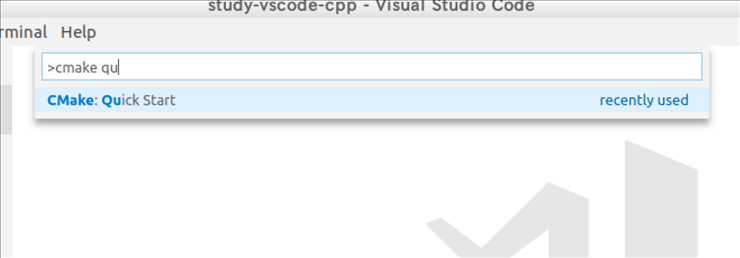
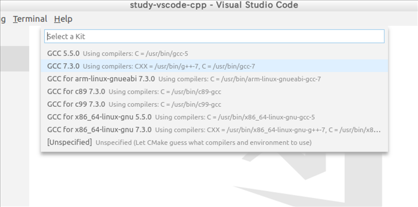
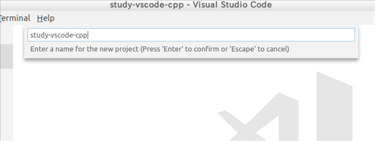
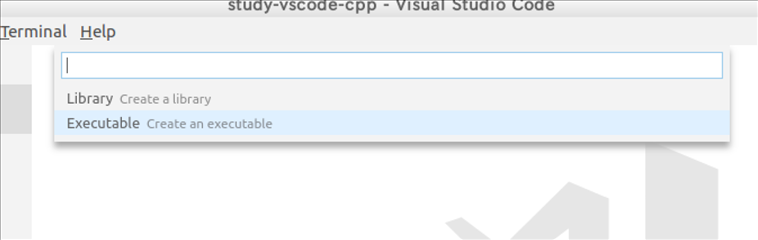
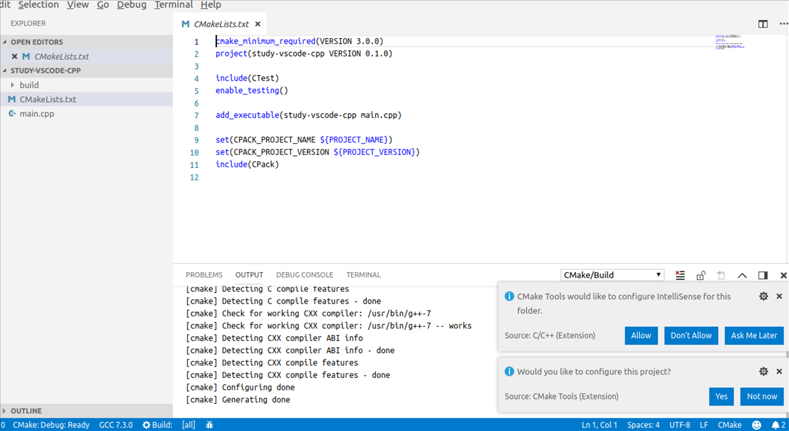
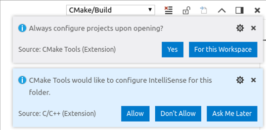
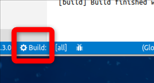
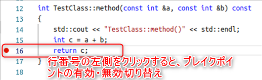
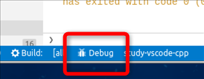
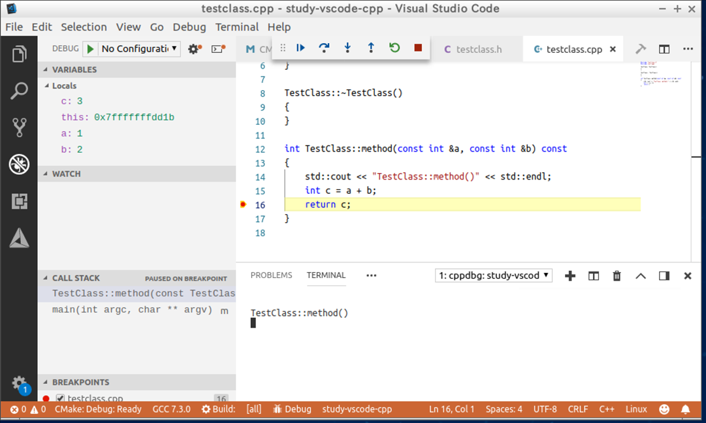

# UbuntuでVSCode+CMake+gcc+gdb開発設定メモ
## 事前準備

  $ sudo apt install cmake build-essential gdb global

## VSCode
インストールしておく機能拡張

  - C++
  - C++ Intellisense
  - CMake
  - CMake Tools
  - EditorConfig for VS Code

## 手順メモ
### ディレクトリの作成

    $ mkdir ~/work
    $ cd ~/work/
    $ mkdir study-vscode-cpp

### CMakeプロジェクトのひな形作成
VSCodeを起動してFile→OpenFolderで~/work/study-vscode-cpp/を開く

ctrl+shift+Pを押して、"CMake: Quick Start"を実行

  - 

"Select a Kit"で使用するコンパイラを指定。

  - 

プロジェクト名を入力。

  - 

実行ファイルを作りたいので"Executable"を選択

  - 

CMakeLists.txtのひな形が作成される。"Wold you like to configure thie project?"はCMakeの設定はすでに終わってるので"Not Now"を押しておく。

  - 

とりあえず、"Allow""Yes"を押しておく。

  - 

### ファイル作成
次のファイルを作成・編集する。

#### .editorconfig
```
root = true

[*]
charset = utf-8
end_of_line = crlf
indent_style = space
trim_trailing_whitespace = true
insert_final_newline = true

[Makefile]
indent_style = tab

[*.{c,h,cpp,hpp,cc}]
indent_size = 4

[*.md]
indent_size = 2

[CMakeLists.txt]
indent_size = 4
```

#### .gitignore
```
build/

GPATH
GRTAGS
GTAGS

CMakeCache.txt
CMakeFiles
Makefile
cmake_install.cmake

*.swp
*~

study-vscode-cpp
```
#### main.cpp
```
#include <iostream>
#include "testclass.h"

int main(int argc, char *argv[])
{
    TestClass test;

    int a = test.method(1, 2);
    std::cout << a << std::endl;

    return 0;
}
```

#### testclass.h
```
class TestClass
{
public:
    TestClass();
    ~TestClass();

    int method(const int &a, const int &b) const;
};
```

#### testclass.cpp
```
#include "testclass.h"
#include <iostream>

TestClass::TestClass()
{
}

TestClass::~TestClass()
{
}

int TestClass::method(const int &a, const int &b) const
{
    std::cout << "TestClass::method()" << std::endl;
    int c = a + b;
    return c;
}
```

### ビルド
ctrl+shift+Pで"CMake:Build"を実行するか、もしくは画面下側の"Build"ボタンを押すとビルドが実行される。

  - 

### デバッグ実行
テキストエディタの行番号の左側をクリックすると、ブレイクポイントが設定できる。

  - 

デバッグ実行は、"CMake:Debug Target"もしくは、画面下側の"Debug"ボタンを押す。

  - 

以下は、ブレイクポイントで停止した状態状態。デバッグウインドウに変数などが表示される。

  - 

## Copyright and license
Copyright (c) 2019 yoggy

Released under the [MIT license](LICENSE.txt)

